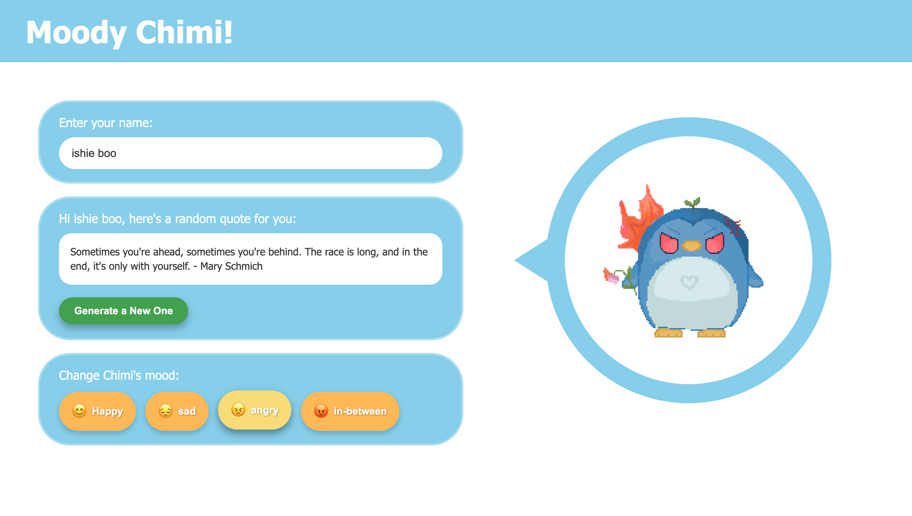

# Moody Chimi 

**Moody Chimi** is a fun and interactive web app that lets users change the mood of a character named **Chimi** while generating random motivational emotion-based quotes.  
It’s designed to make users smile, reflect, and have fun through expressive moods and positive quotes.

**access it here :** linux-22104069@dcism.org
__created as a node.js project for my linux course__
---

## Preview

**Example (Angry Mood):**

